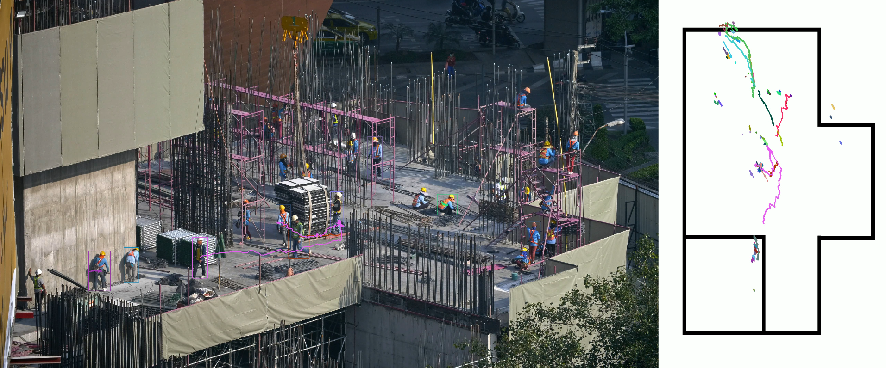
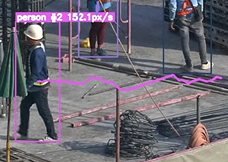
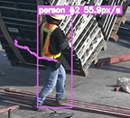

# Real-Time Object Detection Pipeline using YOLOv8


## 📌 Executive Summary
This repository presents a real-time object detection pipeline leveraging Ultralytics YOLOv8, designed as a Proof of Concept (PoC) for automated monitoring solutions in industrial, retail, and smart-city environments.

The system processes video streams frame-by-frame and outputs live detections with bounding boxes, classes, and confidence scores.






---

## 🧠 Technical Overview
### 🎯 Objective

Develop a lightweight, fast, and reliable real-time object detection pipeline suitable for:

* Industrial operational monitoring
* Safety system automation (PPE, restricted areas)
* Retail analytics
* Traffic and pedestrian flow measurements

### 🏗️ System Architecture
```scss
┌─────────────────────┐
│     Video Input     │  (MP4, Webcam, IP Camera)
└──────────┬──────────┘
           │
           ▼
┌─────────────────────┐
│  Frame Preprocessing│  (OpenCV)
└──────────┬──────────┘
           │
           ▼
┌─────────────────────┐
│    YOLOv8 Engine    │  (ultralytics)
│  • Object Detection │
│  • NMS Filtering    │
└──────────┬──────────┘
           │
           ▼
┌─────────────────────┐
│  Post-processing    │
│ • Bounding Boxes    │
│ • Confidence Scores │
│ • Class Labels      │
└──────────┬──────────┘
           │
           ▼
┌─────────────────────┐
│ Visualization Layer │  (OpenCV imshow, or Streamlit)
└─────────────────────┘
```

---

## ⚙️ Technical Specifications
Model
* Architecture: YOLOv8-Nano
* Size: ~6 MB
* FPS (Colab T4 GPU): ~75 FPS
* FPS (CPU i7 7th Gen – seu caso): ~5–10 FPS

Libraries
* ultralytics
* opencv-python
* numpy
* Python 3.8+

Environment
* Google Colab (PoC phase)
* Local CPU inference supported

---

## 🧪 Code Implementation
### 🔧 Core Inference Snippet
```python
from ultralytics import YOLO

# Load the model (Nano version for speed)
model = YOLO("yolov8n.pt")

# Run inference on video source
results = model.predict(
    source="video_path.mp4",
    conf=0.5,          # Minimum confidence threshold
    show=True          # Real-time visualization
)
```

### 📊 Performance & Metrics
| Metric                | Value (YOLOv8n) |
| --------------------- | --------------- |
| mAP 50                | ~37%            |
| Model Size            | 6.2 MB          |
| Inference Speed (CPU) | 5–10 FPS        |
| Inference Speed (GPU) | 70+ FPS         |
| Recommended Use       | Real-time PoC   |

---

## 🏭 Potential Real-World Applications
Industry 4.0
* Worker detection in hazardous areas
* Monitoring of operational flows
* Tracking unauthorized personnel

Retail
* Customer counting
* Heat maps for store optimization

Smart Cities
* Vehicle and pedestrian flow
* Traffic optimization
* Incident detection

Security
* Perimeter surveillance
* Intrusion detection
* Automated alerting

---

## 🔜 Future Improvements
* Implement object tracking (ByteTrack / DeepSORT)
* Generate analytics dashboards (Streamlit / Dash)
* Export detections to a SQL/PostgreSQL database
* Edge deployment on Raspberry Pi + Coral TPU
* Integrate MQTT for industrial automation use-cases
* Save annotated output video automatically

## 🧑‍💼 Professional Notes

This PoC serves as the foundation for:
* Scalable real-time computer vision systems
* Cloud processing pipelines
* Industrial safety automation
* Low-latency monitoring platforms

It demonstrates proficiency in:
* Computer Vision Engineering
* Edge AI model deployment
* Deep learning inference optimization
* Python + OpenCV + YOLO workflows
